# Faciliteei — Front-end

Loja de tecnologia e periféricos: catálogo, carrinho, checkout e painel administrativo. Front-end em Next.js 16 (App Router) consumindo uma API própria em Express/Prisma.

**🔗 [Ver o site no ar](https://ecommerce.otaviobonini.dev)** · [API](https://ecommerce-api.otaviobonini.dev/health) · [Repositório do back-end](https://github.com/otaviobonini/ecommerce-api-node) · [Repositório de infraestrutura](https://github.com/otaviobonini/ecommerce-infra)

---

## Screenshots

### Loja

**Home**

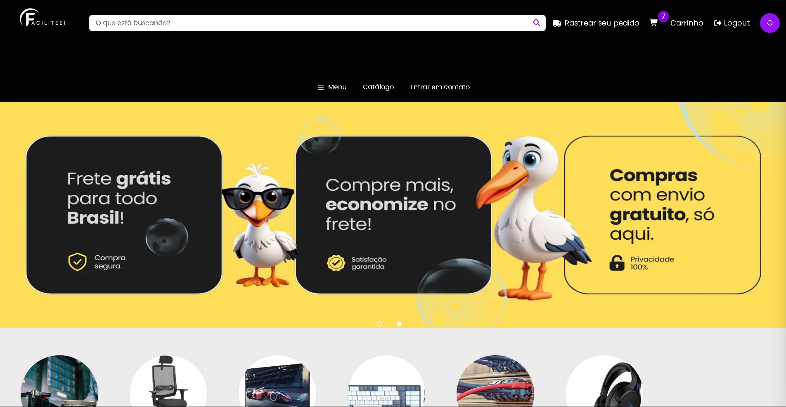

**Home — categorias e mais vendidos**

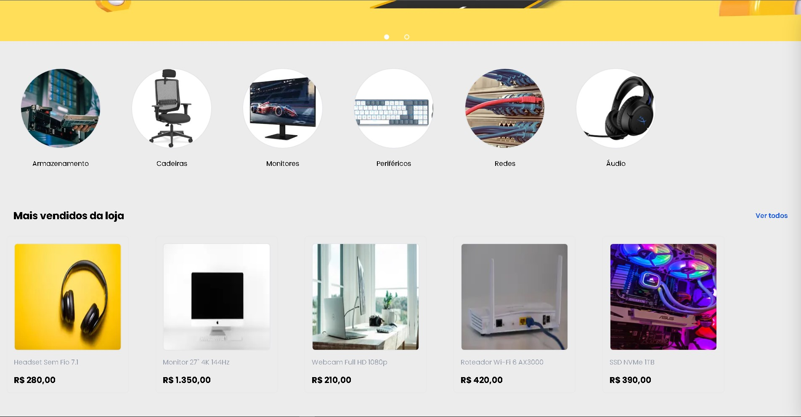

**Listagem por categoria**

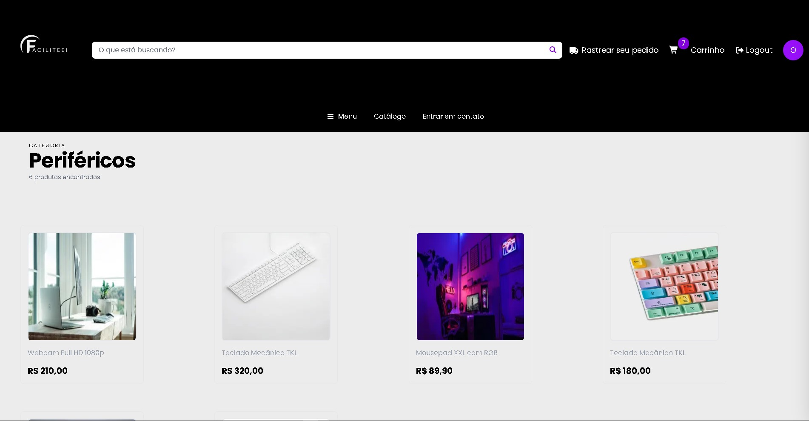

**Página de produto**

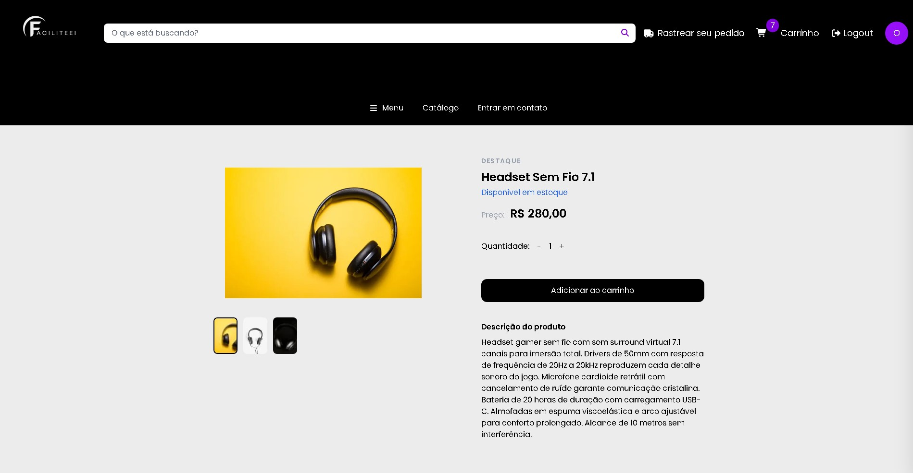

**Contato**

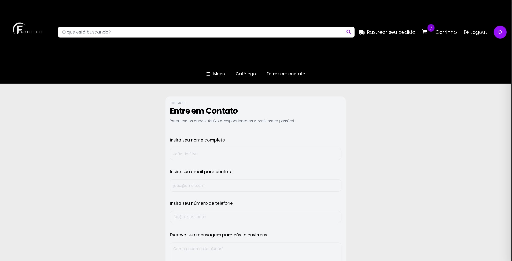

### Conta do cliente

**Perfil**

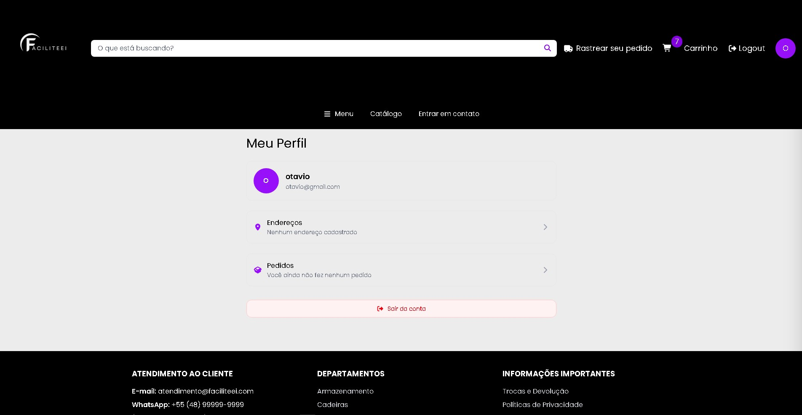

**Endereços**

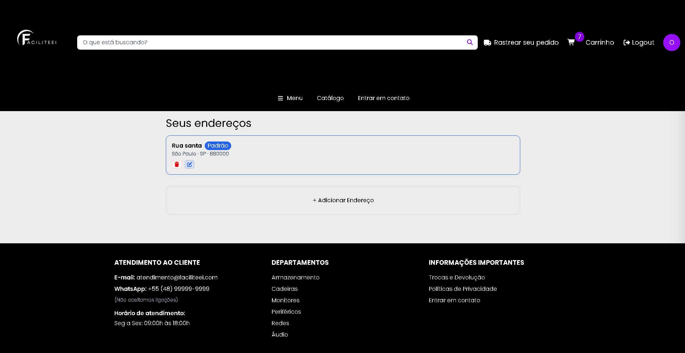

**Meus pedidos**

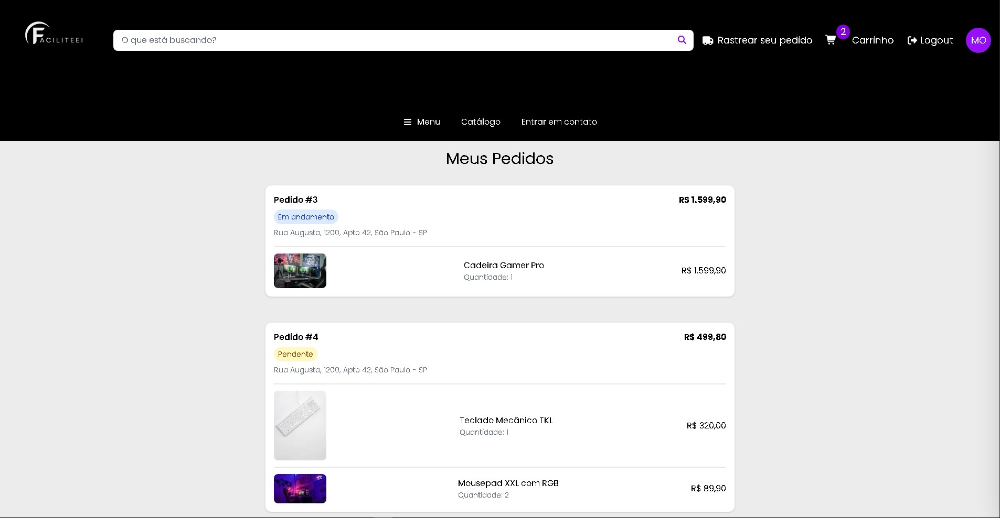

### Painel administrativo

**Visão geral**

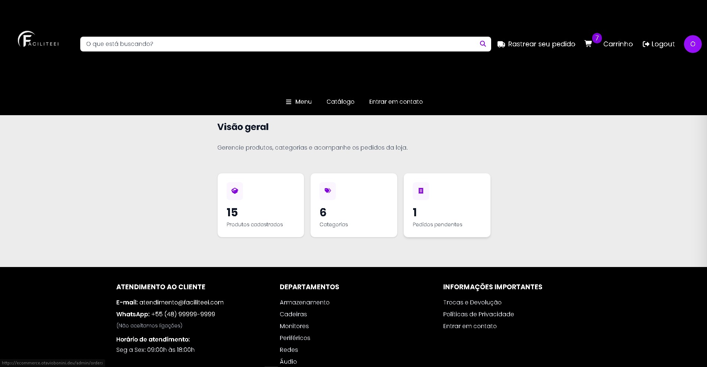

**Produtos**

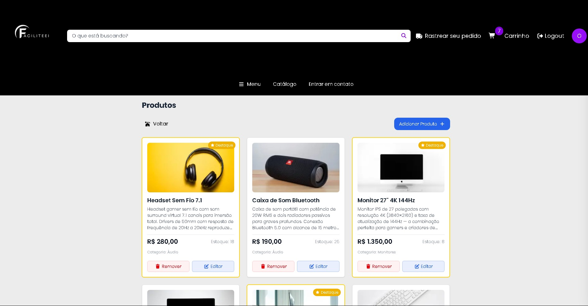

**Categorias**

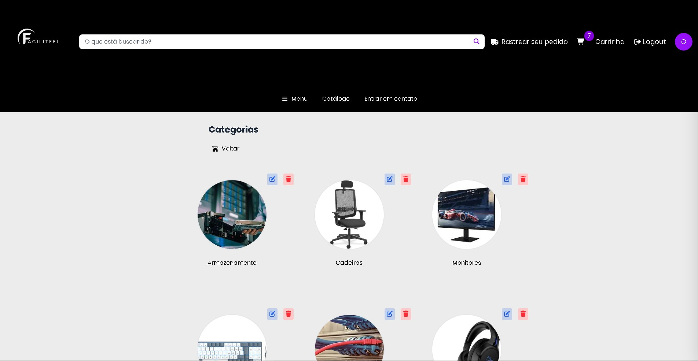

**Pedidos**

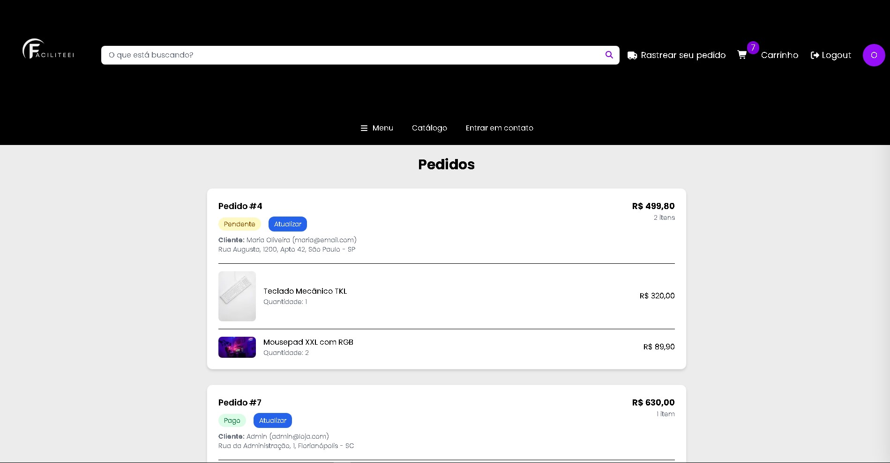

---

## Arquitetura

O projeto é dividido em três repositórios: front-end, API e infraestrutura como código.

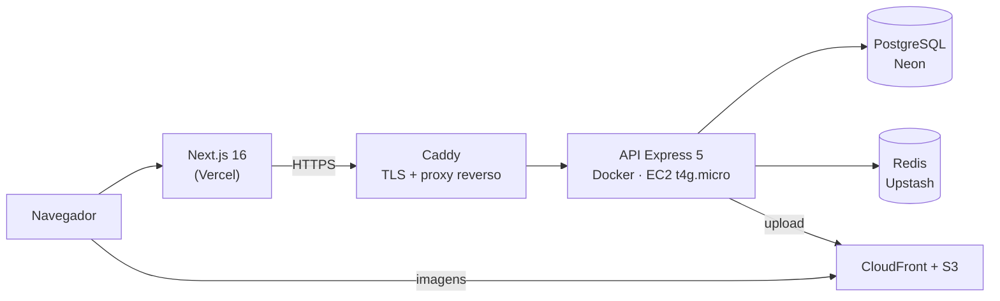

| Camada | Escolha | Motivo |
| --- | --- | --- |
| Front-end | Vercel | Build e CDN nativos pro Next, deploy por push |
| API | EC2 `t4g.micro` (ARM) + Docker | Instância própria pra praticar infra; ARM é mais barato |
| TLS / proxy | Caddy | Certificado automático, config mínima |
| Banco | Neon (Postgres serverless) | Sem servidor pra manter, escala a zero |
| Cache / rate limit | Upstash (Redis) | Limites compartilhados entre instâncias |
| Imagens | S3 + CloudFront | Entrega em CDN, bucket privado |
| Infra | Terraform | EC2, security group, EIP, S3 e CloudFront versionados |

---

## Stack

- **Next.js 16.2.6** (App Router, Server Components, middleware)
- **React 19.2.4** · **TypeScript 5** (strict)
- **Tailwind CSS 4** com design tokens próprios
- **Zod 4** para validação de formulários
- **Vitest 4** + Testing Library — 13 arquivos de teste cobrindo contexts e services
- **ESLint** rodando na CI a cada push

---

## Funcionalidades

**Loja**
- Catálogo com navegação por categorias e página de mais vendidos
- Busca de produtos com dropdown de resultados
- Página de produto com galeria de imagens
- Carrinho persistente por usuário
- Checkout com endereço de entrega
- Histórico de pedidos e acompanhamento de status

**Conta**
- Cadastro e login com sessão via cookie httpOnly
- Perfil e gerenciamento de múltiplos endereços

**Painel administrativo** (`/admin`, restrito a `ADMIN`)
- CRUD de produtos, com upload de imagens pro S3
- CRUD de categorias
- Listagem de pedidos e atualização de status

---

## Decisão técnica: autenticação e o gate de `/admin`

O ponto mais interessante do projeto, e o que deu mais trabalho pra acertar.

**Como a sessão funciona.** O *refresh token* vive num cookie `httpOnly` (invisível pro JavaScript, imune a XSS) e o *access token* fica só em memória no React — nunca em `localStorage`. O refresh token é opaco e rotaciona a cada uso: o antigo é invalidado quando um novo é emitido.

**O problema.** Para proteger `/admin` no servidor, o `middleware.ts` precisa descobrir a role antes de renderizar a página. A primeira versão perguntava isso ao `POST /refresh-token`, que devolve um JWT com a role. Funcionava — e quebrava: como esse endpoint **rotaciona** o token, cada navegação dentro de `/admin` invalidava o cookie anterior. Qualquer descompasso com a renovação automática do `AuthContext` deixava o browser com um token já morto, e o admin era jogado pra home.

**A solução.** Um endpoint dedicado e **somente-leitura**, `POST /auth/admin-session`, que valida o cookie e responde `200` para admin ou `401`/`403` caso contrário — sem rotacionar nada. Sendo idempotente, pode ser chamado a cada navegação sem efeito colateral.

> **Lição:** um token de uso único e rotativo não serve para uma checagem de autorização que roda a cada navegação. A verificação precisa ser idempotente.

O gate do middleware é defesa em profundidade, não a fronteira de segurança: toda rota administrativa da API é validada de novo no servidor.

---

## Rodando localmente

Requer a [API](https://github.com/otaviobonini/ecommerce-api-node) rodando (por padrão em `http://localhost:5000`).

```bash
git clone https://github.com/otaviobonini/ecommerce-next-app.git
cd ecommerce-next-app
npm install
```

Crie um `.env.local`:

```env
NEXT_PUBLIC_API_URL=http://localhost:5000
```

```bash
npm run dev     # http://localhost:3000
```

| Comando | O que faz |
| --- | --- |
| `npm run dev` | Servidor de desenvolvimento |
| `npm run build` | Build de produção |
| `npm test` | Testes com Vitest |
| `npm run test:ui` | Testes com interface gráfica |
| `npm run lint` | ESLint |

O build é resiliente à API estar fora do ar: as categorias do menu são buscadas dentro do componente e falham em silêncio, então o deploy não quebra se a API estiver indisponível no momento do build.
